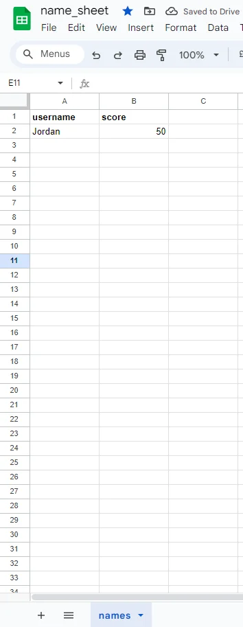

# Hangman Game

I have created this Hangman game to show my ability to work with Python.

Hangman is a game where you have to find the hidden word by trying different letters one-by-one to eventually uncover the whole word. Each correct letter will reveal part of the word and each incorrect answer will add a part to the hangman picture, 6 incorrect guesses and you lose.

### The live website can be seen by clicking [here](https://project-3-hang-man-8c9de00b3c14.herokuapp.com/)

## UX

I want this game to be a fun introduction to the Hangman game, showing you how its played through a fun interactive way. I want the user to enjoy learning the game through the exciting text to create a story like feel to a simple game.

## User stories

The goal of this game is to get people interested in how to play this game and enjoy playing Hangman. The following points are from my user point of view:

* As a user, I want to learn how to play this game.
* As a user, I want to be able to Hangman.
* As a user, I want to be able to play the game without any issues.
* As a user, I want to play a fun insteractive version of the game.

## Strategy

I want the game to be easy to pick up and play and to teach the player how to Hangman. I want the player to enjoy playing the game and learn at the same time having to think strategically what letters to choose.

## Scope

I want the users to experience the game of Hangman while also seeing my skills in creating code in Python. I want the user to enjoy playing the game while learning it without it being too complex but enough to know how to play by the end.

## Structure

The structure of this game allows you to play through the terminal taking you through one step at a time, it links to the sheet that has the information of the saved users and updating the sheet as new players come along, the score is also kept track of keeping it up to date with your progress.

## Skeleton

There isn't really a skeleton for this project. All the code is in the run.py file. Credentials for the API in another file that is set to the .gitignore so the credentials will not be visible.

**Flowchart**

I used Figma to create my flowchart for my game. The flowchart shows the very basic structure of what I saw in my head and gave guidence in to how i wanted my game structured.

You can view the screenshots from my flowchart from clicking the following:

[Click me](assets/readme-assets/project-3-flow-chart.webp)

## Technologies

* I have used Python to create functions for the game.
* I have used Google Sheet API to connect to a Google Sheet.
* I have used Google Sheet for storing the text.

## Features

**Start up screen**

* This section features the initial start of the game.
 

**Asking for users name**

* This section asks for the users name.
* It will either get the saved user from the sheet or create a new users save in the sheet.

**Asks player if they are ready**

* This section will ask the player if they are ready to play.

**Play again**

* This section shows the users option to play another round.

**incorrect guesses**

* This section shows each part of the incorrect answers.

**Correct answer/word**

* This section shows the correct answer and win condition.

**Google sheet**

* This is showing the google sheet in play, for the existing user and for the new user also showing the score update.

## Mechanics

**get_sheet_data**

* Gets the data from the google sheet

**introduction**

* Shows the introduction to the game with some exciting text

**create_user**

* Gets the saved user from the google sheet, adds a new user to the sheet if one doesn't exist

**calculate_score**

* Calculates the players score

**update_score**

* Keeps the google sheet updated with the latest scores

**random_word**

* Gets a random word from the list of wordsto guess

**hidden_word_underline**

* Creates the underline for the hidden word

**check_valid_letter**

* Checks for the players input and whether it is valid

**get_chosen_letter**

* Gets the letter that the user chose

**update_display**

* Updates the display with the chosen letters by the user

**ready_to_play_status**

* Asks the player if they are ready to play

**execute_game**

* Handles all the main aspects of playing out the game

**play_game**

* Allows the user to choose letter and try to guess the hidden word

**play_turn**

* Executes the individual turn of the user

## Error handling

* Check the API connection to Google Sheet.
* Check that Name sheet Google Sheet exists.
* If the 'words.txt' file is not found, the code prints an error message and exits the program.

## Testing

* Tested in my local terminal and the Code Institute Heroku terminal.
* Give invalid inputs: to check whether it only considers alphabetic letters and not to lose a life when a number, a special character, or a space is given.

## Validator Testing

**PEP8**
 
  No errors were found when passing through the official [PEP8 validator](assets/readme-assets/pep8-validator.webp)

## Bugs

Some bugs I encountered were some variables were not called in certain places when i tried to run the code therfore was not playing out as expected. I was able to go through each line to cerrect these issues where neccesary.

I encountered some issues where i had to amny spaces or too little spaces for each function.

Some loops I had not executed properly therfore the loop never ended when the game was asking if the player wanted to continue or stop.

## Deployment

I used the following steps to deploy my project following the Love Sandwitches walkthrough:

* Create new app in Heroku.
* Named it project-3-hang-man.
* Choose Europe as region.
* I went to the Settings tab to create config vars for CREDS and PORT.
* I added the buildpacks Python and Nodejs.
* In the Deploy tab I connected to GitHub repository.
* I manually deployed branch main.

## Credit

### Content

* Some of the code was taken from [RobertAhlin]
* Some of the Code was taken from [anjalee-kulasinghe]

### Acknowledgements

* Inspiration is from [RobertAhli].
* Inspiration is from [anjalee-kulasinghe].
* Ideas were taken from the Code Institute's Love Sandwitches project.
* The the Code Institute tutor support team for helping me with the correct guidance.
* My mentor, Medale Oluwafemi, for his invaluable guidance.
